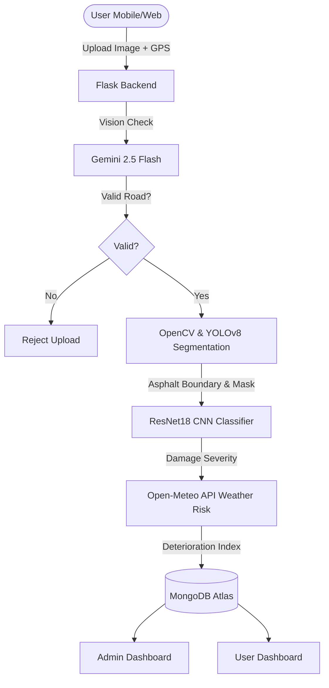

# 🚧 RoadSight: Intelligent Road Damage Detection & Predictive Reporting

RoadSight is an end-to-end, AI-powered system that detects, classifies, verifies, and predicts road damage using citizen-uploaded images, GPS metadata, and weather analytics. 

It combines deep learning (YOLOv8 + ResNet18), Vision AI validation (Gemini), duplicate filtering, hotspot clustering, and predictive maintenance into a unified web dashboard for smarter infrastructure management.

---

## 🚀 Key Features

### 🔍 Multi-Stage AI Pipeline
1. **Gemini Vision Validation:** Instant semantic validation of uploaded photos to filter out invalid reports (e.g. text documents, test papers, indoor photos) before processing.
2. **YOLOv8-Seg Road Detection:** OpenCV-driven trapezoid masking and HSV asphalt color filtering combined with YOLOv8-segmentation object subtraction (removes cars, pedestrians, and background sky).
3. **ResNet18 CNN Classification:** Classifies road conditions into four distinct states: `Good`, `Satisfactory`, `Poor`, and `Very Poor`.

### 🌦 Weather-Based Deterioration Heuristics
- Integrates temperature, precipitation, and freeze-thaw cycles via Open-Meteo.
- Computes a predictive **Deterioration Risk Score** based on local weather conditions over the preceding 7 days.

### 🗺 Hotspot Mapping & Priority Clustering
- Automatically clusters reports using MongoDB 2D geospatial indexing to prevent spam.
- Adjusts severity and priority scores dynamically using local report density.

### 📊 Modern User & Admin Dashboards
- **User Dashboard:** Tracks report status in real-time using an animated milestone timeline.
- **Admin Dashboard:** Features real-time statistical cards, dynamic map visualization, assignment modals, and action tracking for municipal workers.

---

## 🏗 System Architecture



---

## 🛠 Local Setup

### Prerequisites
- Python 3.10+
- MongoDB (running locally or a MongoDB Atlas URI)

### Installation
1. Clone the repository:
   ```bash
   git clone <your-repo-url>
   cd Road-Damage-Detection
   ```

2. Create a virtual environment and activate it:
   ```bash
   python -m venv venv
   # On Windows:
   venv\Scripts\activate
   # On macOS/Linux:
   source venv/bin/activate
   ```

3. Install dependencies:
   ```bash
   pip install -r requirements.txt
   ```

4. Create a `.env` file in the root directory:
   ```env
   MONGO_URI=mongodb://localhost:27017/roadsight
   GEMINI_API_KEY=YOUR_GOOGLE_GEMINI_API_KEY
   SECRET_KEY=generate-a-long-random-string
   ADMIN_EMAIL=admin@example.com
   ADMIN_PASSWORD=admin123
   ```

5. Run the application:
   ```bash
   python app.py
   ```
   Open `http://127.0.0.1:5000` in your browser.

---

## ☁️ Deployment Guide

### Why Render instead of Vercel?
Because RoadSight loads heavyweight deep learning models (`ResNet18` weights and `YOLOv8n-seg.pt` binaries), the deployment package exceeds Vercel’s serverless function limit (50MB). **Render** is the recommended hosting platform as it supports native Python environments with persistent background worker threads.

### Steps to Deploy on Render

1. **Prerequisites:**
   - Commit your code to a GitHub repository.
   - Set up a free **MongoDB Atlas** database and copy the connection string.
   - Get an API key from **Google AI Studio (Gemini)**.

2. **Create a Render Web Service:**
   - Go to [Render](https://render.com) and click **New > Web Service**.
   - Connect your GitHub repository.

3. **Configure Service Details:**
   - **Language:** `Python`
   - **Build Command:** `pip install -r requirements.txt`
   - **Start Command:** `gunicorn app:app`

4. **Add Environment Variables:**
   Under the **Environment** tab in your Render Web Service settings, add the following variables:
   - `MONGO_URI` *(your MongoDB Atlas cloud URI)*
   - `GEMINI_API_KEY` *(your Generative AI Studio API Key)*
   - `SECRET_KEY` *(any random secure hash)*
   - `ADMIN_EMAIL` *(the email you want to use for the Admin panel)*
   - `ADMIN_PASSWORD` *(the password you want to seed)*

5. **Deploy:**
   Click **Deploy Web Service**. Render will install the CPU versions of PyTorch and Ultralytics and spin up the Gunicorn server.
