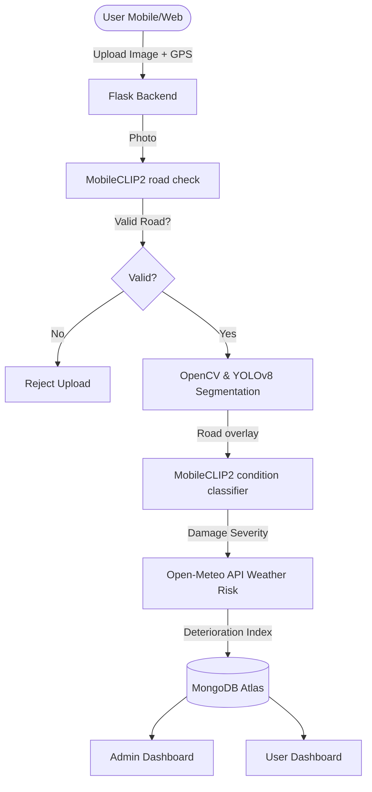

# 🚧 RoadSight: Intelligent Road Damage Detection & Predictive Reporting

RoadSight is an end-to-end, AI-powered system that detects, classifies, verifies, and predicts road damage using citizen-uploaded images, GPS metadata, and weather analytics. 

It combines a vision-language model (MobileCLIP2), YOLOv8 segmentation, Gemini text generation, duplicate filtering, hotspot clustering, and predictive maintenance into a unified web dashboard for smarter infrastructure management.

---

## 🚀 Key Features

### 🔍 AI Pipeline
One small vision-language model, **MobileCLIP2-S2** (36 M-parameter image encoder, ~160 ms per photo on CPU), handles both decisions:

1. **Road check (zero-shot):** it scores the photo against "road" prompts and ~40 "not a road" prompts (planets, space, documents, screenshots, people, animals, food, rooms, textures…). Clear non-roads are rejected, and borderline photos are accepted but flagged **Needs review** for the admin. It runs locally, so it doesn't depend on the Gemini quota.
2. **Condition rating:** `Good`, `Satisfactory`, `Poor` or `Very Poor`, from a classifier trained on the dataset. It's blended with CLIP's zero-shot judgement, which cancels the dataset's camera bias (each class comes from a different source). Every result includes the full probability breakdown and flags low confidence.
3. **Road-surface overlay:** OpenCV perspective and asphalt-colour masks plus YOLOv8-seg (which removes cars and people) draw the green "Road detection" outline. This is display-only.

**Measured quality** (from [`training/metrics.json`](training/metrics.json), on a held-out test split the model never saw):

| | |
|---|---|
| Condition accuracy (311 test photos) | **96.8 %** (Good 100 %, Very Poor 100 %, Satisfactory 97 %, Poor 86 %) |
| Real photos from outside the dataset | 6 / 7 correct |
| Non-road images accepted (planets, moon, text, people, food, floors…) | **0 / 30** |
| Dataset road photos accepted | 99.85 % |

**Retraining** (GPU recommended, a few minutes):
```bash
pip install -r requirements-dev.txt
python training/make_negatives.py   # non-road evaluation images
python training/train.py            # writes models/roadsight_clip.pt, training/metrics.json, training/split.json
```
The split keeps near-duplicate photos together and drops duplicates with conflicting labels. It's saved to `training/split.json`, so results are reproducible. The original notebook and `road_damage_model.pth` (ResNet18) are kept for reference but are no longer used by the app.

### 🌦 Weather-Based Forecasting (Road Health Index)
- Pulls the preceding 7 days and next 7 days of rainfall, heavy-rain days, freeze-thaw cycles and temperature swing from Open-Meteo.
- Computes a **Deterioration Risk Score** (0–1), a **Road Health Index** (0–100, now and projected 30 days out) and a forecast such as *"Likely to deteriorate to 'Poor' in ~38 days"*. Bad weather can double the modelled deterioration rate.

### 🧬 Duplicate & Fraud Filtering
- Every photo gets a perceptual image fingerprint (dHash).
- A report is rejected if it reuses an already-submitted photo (anywhere), shows a visually similar scene within **50 m** of an open report, or comes from the same reporter at the same spot within 24 h.
- When a *different* citizen reports the same damage, that sighting is added to the original report as an independent **confirmation**, which raises its priority.
- The server re-runs the classifier on submit, so the client can't forge the condition.

### 🗺 Hotspot Mapping & Priority
- Open reports within 500 m are clustered into **hotspots** (MongoDB geospatial queries), shown on the admin map as a heatmap plus hotspot circles, along with a ranked hotspot list.
- Priority = 60 % severity + 25 % weather risk + 15 % crowd evidence (nearby reports + confirmations). Very Poor roads are always High.

### 📍 Automatic Geotagging
- GPS is read from the photo's EXIF metadata or the device, and the address is filled in automatically (OpenStreetMap Nominatim). A typed address with no GPS is geocoded on the server.

### 🔔 Notifications
- High-priority reports trigger an e-mail alert to the authorities (`ALERT_EMAILS`).
- Citizens get an e-mail on every status change and on assignment. SMTP works on port 465 (SSL) and 587 (STARTTLS).

### 📱 Citizen Experience
- Drag-and-drop or **take a photo** directly on mobile, a step-by-step progress indicator, a Road Health gauge, per-class probability bars, and a "report it anyway" option for milder damage.
- Share-ready social posts (download, copy, X, WhatsApp).
- A public **Live Map** (`/map`) of every report and its repair status, with clustering and filters. Reporter details are never exposed.
- **My Reports** dashboard with a status timeline for each report.

### 📊 Admin Dashboard
- Stat cards (including hotspots, blocked duplicates and average days to fix), a **reported vs. resolved trend chart**, and a condition breakdown.
- Heatmap/hotspot map, filters by severity, status and priority, **full-text search**, and **CSV export** of the filtered view.
- Field-unit assignment with a scheduled date, status notes (e-mailed to the citizen), a full per-report timeline, and removal of spam reports (kept in an audit log).

### 🛡 Reliability & Security
- Report photos are stored in **MongoDB GridFS**, so they survive redeploys on hosts with temporary disks (Render). Local files are restored on demand.
- Uploads are validated, auto-rotated and downscaled to 1600 px. Filenames are sanitised.
- Per-IP rate limits on analysis, submission, login and signup. All user content is HTML-escaped. The `/api/health` endpoint reports database and model status.

---

## 🏗 System Architecture


```mermaid
graph TD
    User([User Mobile/Web]) -->|Upload Image + GPS| Flask[Flask Backend]
    Flask -->|Photo| CLIP[MobileCLIP2 road check]
    CLIP -->|Valid Road?| RouteDecide{Valid?}
    RouteDecide -->|No| Reject[Reject Upload]
    RouteDecide -->|Yes| OpenCV[OpenCV & YOLOv8 Segmentation]
    OpenCV -->|Road overlay| Classifier[MobileCLIP2 condition classifier]
    Classifier -->|Damage Severity| Weather[Open-Meteo API Weather Risk]
    Weather -->|Deterioration Index| Mongo[(MongoDB Atlas)]
    Mongo --> AdminPanel[Admin Dashboard]
    Mongo --> UserDashboard[User Dashboard]
```

---

## 🛠 Local Setup

### Prerequisites
- Python 3.10+
- MongoDB (running locally or a MongoDB Atlas URI)

### Installation
1. Clone the repository:
   ```bash
   git clone <your-repo-url>
   cd Road-Damage-Detection
   ```

2. Create a virtual environment and activate it:
   ```bash
   python -m venv venv
   # On Windows:
   venv\Scripts\activate
   # On macOS/Linux:
   source venv/bin/activate
   ```

3. Install dependencies:
   ```bash
   pip install -r requirements.txt
   ```

4. Create a `.env` file in the root directory:
   ```env
   MONGO_URI=mongodb://localhost:27017/roadsight
   GEMINI_API_KEY=YOUR_GOOGLE_GEMINI_API_KEY
   SECRET_KEY=generate-a-long-random-string
   ADMIN_EMAIL=admin@example.com
   ADMIN_PASSWORD=change-me            # re-applied on every start, so rotating it works

   # Optional
   ALERT_EMAILS=pwd@city.gov,ops@city.gov   # receive HIGH-priority alerts
   SMTP_HOST=smtp.gmail.com
   SMTP_PORT=587                        # 465 = SSL, 587 = STARTTLS
   SMTP_USER=you@gmail.com
   SMTP_PASS=app-password
   SMTP_FROM=you@gmail.com
   ALLOWED_ORIGINS=                     # only needed if the frontend calls the API cross-origin
   COOKIE_SECURE=                       # auto-enabled on Render; set true behind any HTTPS host
   ```
   Without `GEMINI_API_KEY` the app still works. Road validation falls back to the OpenCV/YOLO heuristics, and descriptions and social posts use templates.

5. Run the application:
   ```bash
   python app.py
   ```
   Open `http://127.0.0.1:5000` in your browser. Flask serves the same `frontend/` pages that Vercel hosts, so there's only one copy of the UI.

6. *(Optional)* Run the tests (needs a local MongoDB; uses a throwaway `roadsight_pytest` database):
   ```bash
   pip install -r requirements-dev.txt
   pytest
   ```

7. *(Optional)* Seed demo reports from the dataset. They go through the same duplicate filter and forecasting as real reports:
   ```bash
   python generate_random_reports.py 20
   ```

---

## ☁️ Deployment Guide (Split Architecture: Vercel + Render)

To maximize performance, fast load times, and manage package sizes, the application is divided into:
1. **Frontend (hosted on Vercel)**: Serves static assets, CSS, and HTML pages. Uses server rewrites to securely communicate with the backend without CORS issues.
2. **Backend (hosted on Render)**: A Python Web Service that runs Gunicorn, holds the MobileCLIP2 and YOLOv8 models, processes images, and communicates with MongoDB Atlas.

---

### 1. Deploy the Backend on Render

1. **Prerequisites:**
   - Commit your code to a GitHub repository.
   - Set up a free **MongoDB Atlas** database and copy the connection string.
   - Get an API key from **Google AI Studio (Gemini)**.

> **Fastest path:** in Render choose **New > Blueprint** and point it at this repo. [`render.yaml`](render.yaml) sets the build (CPU-only PyTorch, which is much smaller than the default CUDA build), the start command and the health check. You then only fill in the secret env vars. The manual steps below do the same thing.

2. **Create a Render Web Service:**
   - Go to [Render](https://render.com) and click **New > Web Service**.
   - Connect your GitHub repository.

3. **Configure Service Details:**
   - **Name:** `road-damage-backend` (or similar)
   - **Language:** `Python`
   - **Build Command:** `pip install torch==2.9.1 torchvision==0.24.1 --index-url https://download.pytorch.org/whl/cpu && pip install -r requirements.txt`
   - **Start Command:** `gunicorn app:app --workers 1 --threads 4 --timeout 180`

4. **Add Environment Variables:**
   Under the **Environment** tab, add:
   - `MONGO_URI` *(your MongoDB Atlas cloud URI)*
   - `GEMINI_API_KEY` *(your Google AI Studio API Key)*
   - `SECRET_KEY` *(any random secure string for sessions)*
   - `ADMIN_EMAIL` *(the email you want to use for the Admin panel)*
   - `ADMIN_PASSWORD` *(the admin password, applied on every start)*
   - `ALERT_EMAILS`, `SMTP_*` *(optional, for authority alerts and citizen e-mails)*

5. **Deploy:**
   Click **Deploy Web Service**. Render will spin up the Gunicorn server. Note down your backend URL (e.g. `https://road-damage-backend.onrender.com`).

---

### 2. Deploy the Frontend on Vercel

1. **Configure Vercel Rewrite Rules:**
   - Open [frontend/vercel.json](file:///d:/Programming/Projects/Project/Road-Damage-Detection/frontend/vercel.json) in your project.
   - Replace `https://YOUR-RENDER-BACKEND-URL.onrender.com` with your actual Render backend URL in all rewrite rules.
   - Commit and push this change to your GitHub repository.

2. **Create a Vercel Project:**
   - Go to [Vercel](https://vercel.com) and click **Add New > Project**.
   - Import your GitHub repository.

3. **Configure Build Settings:**
   - **Framework Preset:** `Other` (or leave as default)
   - **Root Directory:** Edit this and select the `frontend` folder.
   - **Build Command:** Leave empty (no build step is needed).
   - **Output Directory:** Leave empty (defaults to the root of the selected `frontend` folder).

4. **Deploy:**
   - Click **Deploy**. Vercel will instantly host your static frontend at a secure `.vercel.app` domain.
   - Because of the rewrite rules defined in `vercel.json`, all login, upload, and API requests will be securely proxied to your Render backend under the hood, completely avoiding cross-origin (CORS) errors!

