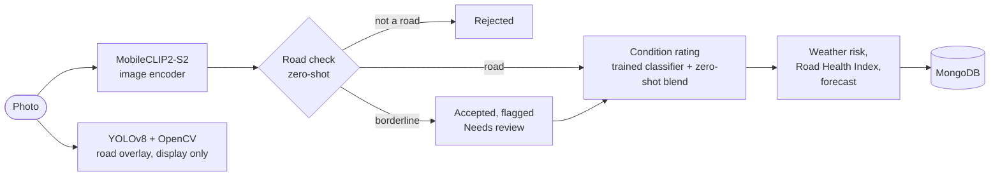

# 🚧 RoadSight — AI Road Damage Detection & Reporting

RoadSight lets citizens report damaged roads with a photo. The AI checks that the photo really shows a road and rates its condition. The system also forecasts how fast the damage will get worse, filters out duplicate and fake reports, and gives municipal teams a dashboard to prioritise, schedule and track repairs.

**Stack:** Flask · MongoDB (+ GridFS) · MobileCLIP2 · YOLOv8 · Open-Meteo · OpenStreetMap · Gemini (optional) · Bootstrap / Tailwind / Leaflet / Chart.js

---

## ✨ Features

**For citizens**
- Upload or take a photo (drag-and-drop or the phone camera) and get the road's condition, per-class probabilities and a 0–100 **Road Health Index**.
- Location is filled in automatically from the photo's GPS data or the device, and the address is looked up via OpenStreetMap.
- Submit an official report and track its status on the **My Reports** timeline. Email updates are sent when the status changes.
- A public **Live Map** (`/map`) of every report and its repair status. Reporter details are never shown.
- Share-ready social posts (download, copy, X, WhatsApp).

**For administrators**
- Stat cards, a reported-vs-resolved trend chart, a condition breakdown and the average number of days to fix.
- A map with a damage heatmap and **hotspots**: clusters of open reports within 500 m.
- Filter by severity, status and priority, search reports, and **export CSV**.
- Assign field units with a scheduled date, update the status with notes (emailed to the citizen), and view each report's full timeline.
- A **Needs review** queue for photos the AI couldn't fully verify, and removal of spam reports (kept in an audit log).

**Behind the scenes**
- **Duplicate and fraud filtering:** a report is rejected if its photo was already submitted, if a visually similar photo was reported within **50 m**, or if the same person reports the same spot within 24 h. When a *different* person reports the same damage, it counts as a **confirmation** and raises the original report's priority.
- **Weather-based forecast:** the past and next 7 days of rain, heavy-rain days, freeze-thaw cycles and temperature swings (from Open-Meteo) give a deterioration risk. From that, the app estimates when the road will reach the next worse category (for example, *"Likely to deteriorate to 'Poor' in ~38 days"*).
- **Priority** = 60 % severity + 25 % weather risk + 15 % crowd evidence. *Very Poor* is always High.
- **Email alerts** to the authorities (`ALERT_EMAILS`) for high-priority reports.
- Photos are stored in **MongoDB GridFS**, so they survive redeploys on hosts that wipe their disk. There are also per-IP rate limits, upload validation, HTML escaping throughout, and a `/api/health` endpoint.

---

## 🧠 How the AI works


```mermaid
graph LR
    P([Photo]) --> E[MobileCLIP2-S2<br/>image encoder]
    E --> G{Road check<br/>zero-shot}
    G -->|not a road| R[Rejected]
    G -->|borderline| F[Accepted, flagged<br/>Needs review]
    G -->|road| C[Condition rating<br/>trained classifier + zero-shot blend]
    F --> C
    C --> W[Weather risk,<br/>Road Health Index,<br/>forecast]
    W --> D[(MongoDB)]
    P --> Y[YOLOv8 + OpenCV<br/>road overlay, display only]
```

One small vision-language model, **MobileCLIP2-S2** (36M-parameter image encoder, about 160 ms per photo on CPU), makes both decisions from a single pass:

1. **Road check.** The photo is compared against descriptions of roads and ~40 descriptions of things that are not roads (planets, documents, screenshots, people, animals, food, rooms, textures…). This works without training data, so it holds up on photos unlike anything in the dataset.
2. **Condition rating** (`Good`, `Satisfactory`, `Poor`, `Very Poor`). A classifier trained on the dataset is blended with the model's own zero-shot judgement. The blend counters a bias in the dataset: each class comes from a different camera source, and without it, any web-style photo drifts toward *Very Poor*.

**Measured on a held-out test split the model never saw** ([`training/metrics.json`](training/metrics.json)):

| | |
|---|---|
| Condition accuracy (311 test photos) | **96.8 %** — Good 100 %, Very Poor 100 %, Satisfactory 97 %, Poor 86 % |
| Real road photos from outside the dataset | 6 / 7 correct |
| Non-road images accepted (planets, moon, text, people, food, floors…) | **0 / 30** |
| Dataset road photos accepted | 99.85 % |

**Known limitations:** *Poor* is the weakest class (sometimes rated *Satisfactory*). The dataset has ~2,000 photos from only three sources, so more varied, labelled photos (especially good roads and phone photos) would improve accuracy the most.

### Retraining
```bash
pip install -r requirements-dev.txt
python training/make_negatives.py   # builds the non-road evaluation images
python training/train.py            # writes models/roadsight_clip.pt, training/metrics.json, training/split.json
```
The split (70/15/15, seed 42) keeps near-duplicate photos together and drops duplicates with conflicting labels, so results are reproducible. The original notebook and `road_damage_model.pth` (ResNet18) are kept for reference but no longer used.

---

## 🛠 Local setup

**Prerequisites:** Python 3.10+ and MongoDB (local, or a MongoDB Atlas URI).

```bash
git clone https://github.com/PrathamAgarwal1/Road-Damage-Detection-and-Reporting-System.git
cd Road-Damage-Detection-and-Reporting-System
python -m venv venv
venv\Scripts\activate            # Windows  (macOS/Linux: source venv/bin/activate)
pip install -r requirements.txt
```

Create a `.env` file in the project root:
```env
MONGO_URI=mongodb://localhost:27017/roadsight
SECRET_KEY=generate-a-long-random-string
ADMIN_EMAIL=admin@example.com
ADMIN_PASSWORD=change-me              # applied on every start, so changing it here works

# Optional
GEMINI_API_KEY=                       # AI-written report descriptions and social posts (templates otherwise)
ALERT_EMAILS=pwd@city.gov,ops@city.gov   # receive HIGH-priority alerts
SMTP_HOST=smtp.gmail.com
SMTP_PORT=587                         # 465 = SSL, 587 = STARTTLS
SMTP_USER=you@gmail.com
SMTP_PASS=app-password
SMTP_FROM=you@gmail.com
```

Run it:
```bash
python app.py
```
Open http://127.0.0.1:5000. Flask serves the same `frontend/` pages that Vercel hosts.

| Page | URL |
|---|---|
| Report damage | `/` |
| Live map | `/map` |
| My reports | `/user/dashboard` (after signing up) |
| Admin | `/admin/login` (uses `ADMIN_EMAIL` / `ADMIN_PASSWORD`) |

**Optional:**
```bash
python generate_random_reports.py 20      # seed demo reports from the dataset
pip install -r requirements-dev.txt
pytest                                    # 28 tests; needs a local MongoDB (uses a throwaway database)
```

---

## ☁️ Deployment (Render backend + Vercel frontend)

### Backend on Render
The easiest way is **New > Blueprint** in Render, pointed at this repo. [`render.yaml`](render.yaml) configures everything, and you only enter the secret environment variables.

For a manually created **Web Service**, use:

| Setting | Value |
|---|---|
| Build command | `pip install torch==2.9.1 torchvision==0.24.1 --index-url https://download.pytorch.org/whl/cpu && pip install -r requirements.txt` |
| Start command | `gunicorn app:app --workers 1 --threads 4 --timeout 180` |
| Health check path | `/api/health` |
| Instance type | **Starter or higher.** The models need ~450 MB RAM, which is too much for the free 512 MB instance. |
| Environment | `MONGO_URI`, `SECRET_KEY`, `ADMIN_EMAIL`, `ADMIN_PASSWORD`, plus the optional variables above |

The CPU-only PyTorch install avoids ~2 GB of GPU libraries that Render can't use.

### Frontend on Vercel
1. **Add New > Project**, import this repo, and set **Root Directory** to `frontend`. No build command or output directory is needed.
2. [`frontend/vercel.json`](frontend/vercel.json) proxies all API, upload and login routes to the backend, so there are no CORS issues. If your Render URL differs from `https://roadsight-backend.onrender.com`, update it there.

---

## 📁 Project structure

```
app.py                     Flask routes: analysis, reports, auth, admin and public APIs
vision.py                  MobileCLIP2 road check + condition classifier (runtime)
services.py                MongoDB/GridFS, weather forecast, duplicates, priority, hotspots, email
generate_random_reports.py Demo data from the dataset
models/roadsight_clip.pt   Trained vision model (produced by training/train.py)
training/                  Training script, split, metrics and non-road evaluation images
frontend/                  Static pages + JS/CSS (served by Flask locally, by Vercel in production)
tests/                     pytest suite
road_damage_dataset/       Training images: good / satisfactory / poor / very_poor
render.yaml                Render deployment blueprint
```

## 🔌 API overview

| Method & path | Purpose |
|---|---|
| `POST /analyze` | Upload a photo (`image`) and get the road check, condition, probabilities, health index and overlay |
| `POST /submit-report` | Submit an analysed photo with its location (duplicate filtering, forecast, priority) |
| `GET /api/public/reports`, `GET /api/public/stats` | Anonymised data for the live map and counters |
| `GET /api/user/reports`, `GET /api/user/milestones/<id>` | The logged-in citizen's reports and timelines |
| `GET /api/reports` · `/export.csv` · `/<id>/timeline` | Admin: list, export and timeline (filters: `severity`, `status`, `priority`, `q`, `sort`) |
| `POST /api/reports/<id>/status` · `/assign` · `DELETE /api/reports/<id>` | Admin: update status, assign a unit, remove spam |
| `GET /api/admin/stats` · `/analytics` · `/hotspots` | Admin dashboard data |
| `GET /api/health` | Database and model status |
